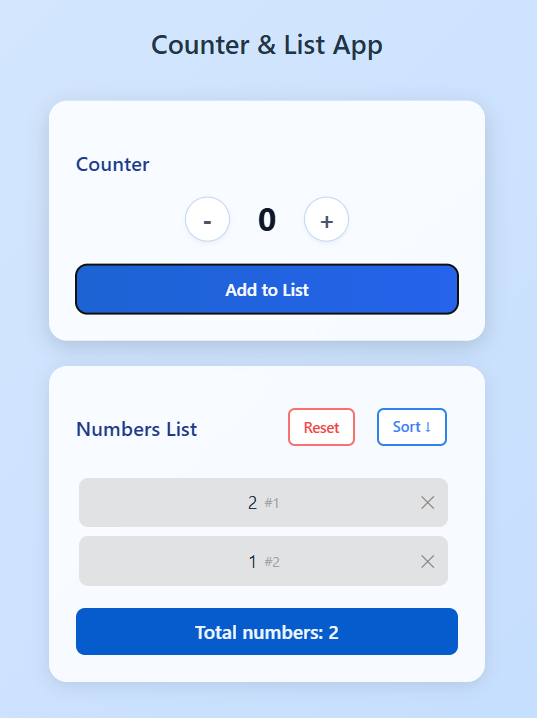

# 📊 Counter & List App

A simple React application that allows users to increment/decrement a counter, add values to a list, and manage the list with sorting, deletion, and reset options. The application uses **localStorage** to persist data even after a page refresh.

---

## 🚀 Features

### **Counter**

- Increment (`+`) or decrement (`-`) a number (never goes below 0).
- Add the current counter value to the list (only if greater than 0 and not already in the list).
- Automatically resets the counter to 0 after adding to the list.

### **List View**
- Displays all added numbers in a scrollable container.
- Shows the position/index of each number.
- Remove specific numbers from the list.
- Reset the entire list.
- Sort list in ascending (`↓`) or descending (`↑`) order.
- Persistent data storage using `localStorage`.
- Indicated the highest value with green background and smallest value with red background.

---

## 🛠️ Tech Stack

- **React.js** – UI framework
- **JavaScript (ES6+)** – Logic and interactivity
- **CSS (Glassmorphism UI)** – Styling and responsive design
- **LocalStorage** – Persistent data storage

---

## 📂 Project Structure

counter-list-app/
│
├── src/
│ ├── components/
│ │ ├── Counter.jsx # Counter UI and buttons
│ │ ├── ListView.jsx # Numbers list and controls
│ ├── App.jsx # Main component - state management
│ ├── App.css # Main styling
│ ├── index.jsx # Entry point
│ ├── index.css # Global styles
│
├── package.json
├── README.me

---

## 🔄 How It Works

1. **State Management**

   - All shared state (`count` and `numbers`) is stored in `App.jsx` to allow communication between `Counter` and `ListView`.

2. **Data Flow**  
   App.jsx
   ├── Counter.jsx → receives count & increment/decrement functions
   └── ListView.jsx → receives numbers & list management functions

3. **Persistence**

- The list of numbers is saved to `localStorage` whenever it changes, so the data remains after refresh.

---

## 📸 Screenshots

**Counter Section**


**List Section**
Numbers List [Reset] [Sort ↓]


---

## ⚙️ Installation & Setup

1. **Clone the repository**
   ```bash
   git clone https://github.com/your-username/counter-list-app.git
   cd counter-list-app
   ```

Install dependencies --> npm install
Run the application --> npm run dev
Build for production --> npm run build

## Key Concepts Learned

State Lifting: Keeping count and numbers in App.jsx so that both Counter and ListView can access them without prop drilling.
Conditional Rendering: Showing "No numbers added" when the list is empty.
LocalStorage Integration: Persisting data between page reloads.
Reusable Components: Separate, clean UI components for counter and list.
